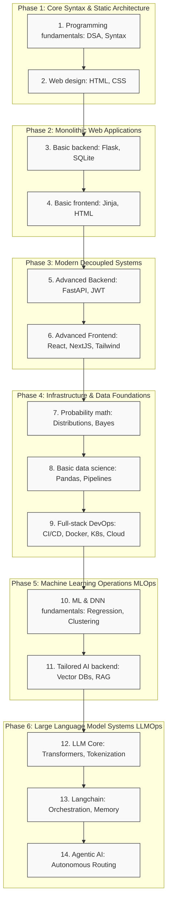

# Full-Stack AI Engineer Roadmap - Architecture Overview

## Overview

This roadmap outlines a comprehensive learning path for becoming a full-stack AI engineer, spanning 6 progressive phases:

1. **Phase 1**: Foundation in programming fundamentals and web design basics
2. **Phase 2**: Monolithic web application development with Flask and Jinja
3. **Phase 3**: Modern decoupled architectures with FastAPI and React
4. **Phase 4**: Infrastructure, DevOps, and foundational data science skills
5. **Phase 5**: Machine learning and specialized AI backend development with vector databases and RAG
6. **Phase 6**: Advanced LLM systems, orchestration, and agentic AI implementations